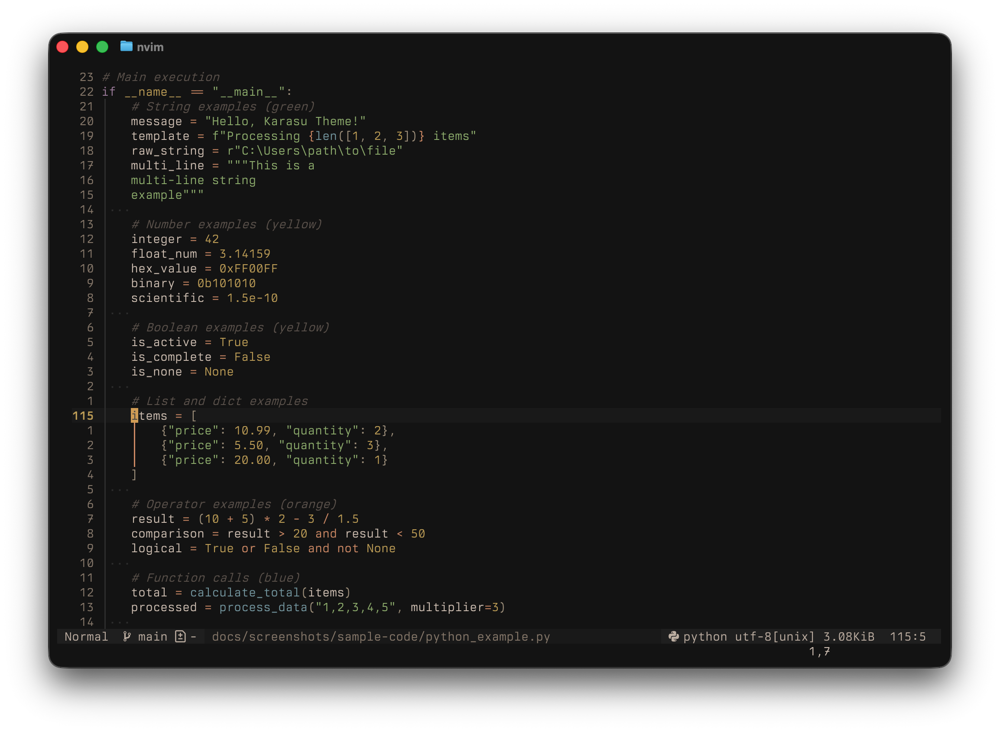
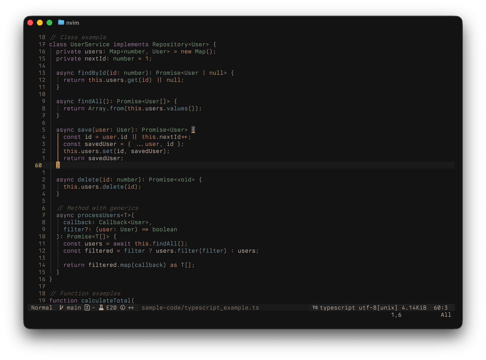
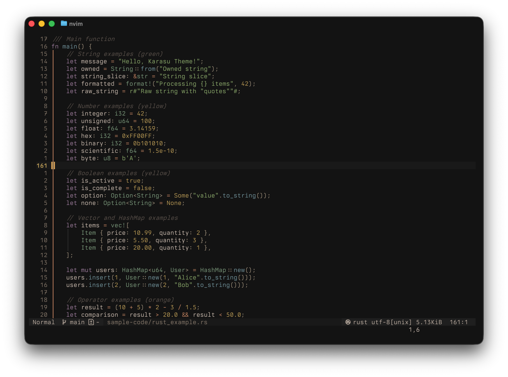
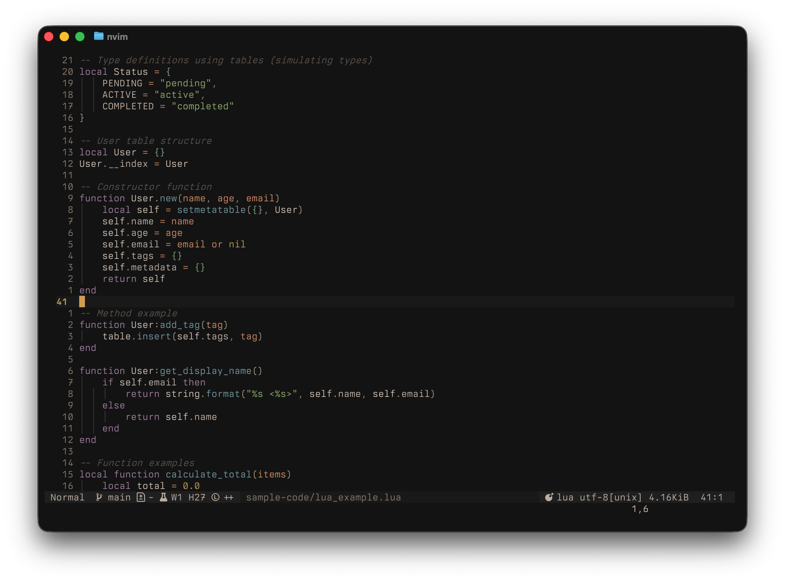
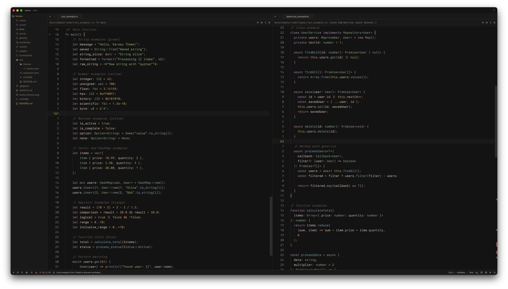

# Karasu (カラス) Colorscheme

A dark, atmospheric colorscheme combining the warmth of Gruvbox Material Dark with the sophistication of Kanagawa Dragon and the minimalist elegance of Black Metal aesthetics. Karasu (meaning "crow" in Japanese) provides a unified, refined dark experience across multiple editors and terminals.

## Overview

Karasu blends Material Design dark backgrounds with carefully balanced warm earth tones, creating a sophisticated palette that's both comfortable for long coding sessions and visually striking. The scheme emphasizes readability while maintaining atmospheric depth through layered backgrounds and harmonious color relationships.

## Quick Install

### Neovim
```lua
-- Using lazy.nvim
{
  'scozu/karasu',
  lazy = false,
  priority = 1000,
  config = function()
    require('karasu').setup({
      transparent = false,
      italic_comments = true,
      contrast = 'medium'
    })
  end
}
```

### Cursor (VS Code)
Install from the VS Code Marketplace: `scozu.karasu`

### Ghostty
```bash
# Download to Ghostty config directory
curl -o ~/.config/ghostty/themes/karasu https://raw.githubusercontent.com/scozu/karasu/main/ghostty/karasu
echo "include ~/.config/ghostty/themes/karasu" >> ~/.config/ghostty/config
```

### Zed
Install from the Zed extensions marketplace or manually:
```bash
# Clone to Zed extensions directory
git clone https://github.com/scozu/karasu ~/.config/zed/extensions/karasu
```

### Terminal Emulators
See platform-specific READMEs in respective directories:
- [Alacritty](extras/alacritty/) - TOML configuration
- [Kitty](extras/kitty/) - `.conf` format  
- [WezTerm](extras/wezterm/) - Lua configuration
- [iTerm2](extras/iterm2/) - `.itermcolors` file

## Design Philosophy

- **Material dark backgrounds** - Elevated surfaces with subtle depth (#121212 base)
- **Warm earth tones** - Muted, saturated colors inspired by natural materials
- **Balanced contrast** - Readable without eye strain, optimized for long sessions
- **Consistent experience** - Unified palette across all supported platforms
- **Sophisticated palette** - Carefully chosen colors that work harmoniously together

## Color Palette

### Background Layers
```
karasuBg0: #121212       /* Main background - Material dark */
karasuBg1: #1a1a1a       /* Elevated surfaces */
karasuBg2: #222222       /* Popups, menus */
karasuBg3: #2a2a2a       /* Higher elevation */
karasuBg4: #333333       /* Borders, separators */
karasuBgVisual: #2d3437  /* Visual selection */
karasuBgSearch: #3c4144  /* Search highlights */
```

### Foreground Tones
```
karasuFg0: #d4c5b9    /* Primary text - warm cream */
karasuFg1: #c5b6aa    /* Secondary text */
karasuFg2: #a89984    /* Tertiary text */
karasuFg3: #928374    /* Muted text */
karasuFgDim: #665c54  /* Dimmed text, comments */
```

### Syntax Colors (Saturated)
```
karasuRed: #c4746e       /* Errors, deletions, important keywords */
karasuGreen: #95b572     /* Strings, additions, success */
karasuYellow: #c4a657    /* Warnings, numbers, constants */
karasuBlue: #7c9fa8      /* Functions, methods, identifiers */
karasuPurple: #a987a8    /* Keywords, control flow */
karasuAqua: #85a585      /* Classes, types, special */
karasuOrange: #d6936b    /* Parameters, attributes, operators */
```

### Bright Accents
```
karasuBrightRed: #ea6962
karasuBrightGreen: #a9b665
karasuBrightYellow: #d8a657
karasuBrightBlue: #8ba4b0
karasuBrightMagenta: #d3869b
karasuBrightCyan: #89b482
karasuBrightWhite: #fbf1c7
```

## Platform Support

- ✅ **Neovim** - Full Lua-based colorscheme with TreeSitter & LSP support
- ✅ **Ghostty** - Terminal configuration with ANSI colors
- ✅ **Zed** - JSON theme with complete UI mapping
- ✅ **Cursor** - VS Code compatible theme with semantic tokens
- 🔄 **Terminal extras** - Alacritty, Kitty, WezTerm, iTerm2

## Project Structure

```
karasu/
├── README.md
├── LICENSE
├── palette-showcase.html    # Interactive color preview
├── screenshots/             # Syntax highlighting screenshots
│   ├── README.md
│   └── *.png                # Platform and language screenshots
│
├── lua/
│   └── karasu/             # Neovim colorscheme
│       ├── init.lua         # Main entry
│       ├── colors.lua       # Color palette
│       ├── themes.lua       # Theme definitions
│       ├── highlights/      # Organized highlight groups
│       │   ├── editor.lua
│       │   ├── syntax.lua
│       │   ├── treesitter.lua
│       │   ├── lsp.lua
│       │   └── plugins.lua
│       └── utils.lua
│
├── palette/
│   ├── colors.json          # Master color palette (portable)
│   ├── colors.lua           # Lua definitions (Neovim)
│   └── README.md            # Color documentation
│
├── ghostty/
│   ├── karasu
│   └── README.md
│
├── zed/
│   ├── themes/karasu.json
│   └── README.md
│
├── cursor/
│   ├── themes/karasu.json
│   ├── package.json
│   └── README.md
│
├── extras/
│   ├── alacritty/
│   │   └── karasu.toml
│   ├── kitty/
│   │   └── karasu.conf
│   ├── wezterm/
│   │   └── karasu.lua
│   └── iterm2/
│       └── karasu.itermcolors
│
└── docs/
    ├── design-notes.md       # Design decisions and rationale
    ├── color-reference.md    # Detailed color reference
    └── porting-guide.md      # Guide for porting to other editors
```

## Implementation Details

### Neovim

**Structure**: Modular Lua-based colorscheme following modern best practices

**Key Features**:
- Full TreeSitter syntax highlighting
- LSP diagnostic colors with semantic tokens
- Extensive plugin support (Telescope, nvim-tree, GitSigns, etc.)
- Diff and Git integration
- Optional italics and transparency
- Customizable highlight overrides

**Syntax Strategy**:
- Keywords (`karasuPurple`) - Control flow, declarations
- Functions (`karasuBlue`) - Method calls, function definitions
- Strings (`karasuGreen`) - String literals, documentation
- Numbers (`karasuYellow`) - Numeric constants
- Types (`karasuAqua`) - Classes, interfaces, type annotations
- Operators (`karasuOrange`) - Arithmetic, logical operators
- Comments (`karasuFgDim`) - Code comments, documentation
- Variables (`karasuFg0`) - Identifiers, properties

### Ghostty Terminal

**Configuration**: Native `.conf` format with full ANSI support

```conf
# Karasu - Material Dark Theme
palette = 0=#121212   # Black (karasuBg0)
palette = 1=#c4746e   # Red (karasuRed)
palette = 2=#95b572   # Green (karasuGreen)
palette = 3=#c4a657   # Yellow (karasuYellow)
palette = 4=#7c9fa8   # Blue (karasuBlue)
palette = 5=#a987a8   # Magenta (karasuPurple)
palette = 6=#85a585   # Cyan (karasuAqua)
palette = 7=#d4c5b9   # White (karasuFg0)
palette = 8=#665c54   # Bright Black (karasuFgDim)
palette = 9=#ea6962   # Bright Red (karasuBrightRed)
palette = 10=#a9b665  # Bright Green (karasuBrightGreen)
palette = 11=#d8a657  # Bright Yellow (karasuBrightYellow)
palette = 12=#8ba4b0  # Bright Blue (karasuBrightBlue)
palette = 13=#d3869b  # Bright Magenta (karasuBrightMagenta)
palette = 14=#89b482  # Bright Cyan (karasuBrightCyan)
palette = 15=#fbf1c7  # Bright White (karasuBrightWhite)

background = 121212       # karasuBg0
foreground = d4c5b9       # karasuFg0
cursor-color = d8a657     # karasuBrightYellow
selection-background = 2d3437  # karasuBgVisual
selection-foreground = d4c5b9  # karasuFg0
```

### Zed Editor

**Format**: JSON theme following Zed's v0.1.0 schema

**Features**:
- Complete UI element mapping
- Syntax token colors
- Git integration colors
- Diagnostic colors (errors, warnings, info)
- Search and selection highlights
- Terminal ANSI colors

### Cursor (VS Code)

**Format**: VS Code theme JSON + extension manifest

**Features**:
- TextMate scope mappings for all common languages
- Semantic token support (LSP)
- Editor UI customization (sidebar, status bar, tabs)
- Git decoration colors
- Bracket pair colorization
- Terminal integration

### Terminal Extras

**Alacritty** (TOML format):
```toml
[colors]
primary = { background = "#121212", foreground = "#d4c5b9" }
cursor = { text = "#121212", cursor = "#d8a657" }
selection = { background = "#2d3437", foreground = "#d4c5b9" }

[colors.normal]
black = "#121212"
red = "#c4746e"
green = "#95b572"
yellow = "#c4a657"
blue = "#7c9fa8"
magenta = "#a987a8"
cyan = "#85a585"
white = "#d4c5b9"

[colors.bright]
black = "#665c54"
red = "#ea6962"
green = "#a9b665"
yellow = "#d8a657"
blue = "#8ba4b0"
magenta = "#d3869b"
cyan = "#89b482"
white = "#fbf1c7"
```

**Kitty** (conf format):
```conf
background #121212
foreground #d4c5b9
cursor #d8a657
selection_background #2d3437
selection_foreground #d4c5b9

# Normal colors
color0 #121212
color1 #c4746e
color2 #95b572
color3 #c4a657
color4 #7c9fa8
color5 #a987a8
color6 #85a585
color7 #d4c5b9

# Bright colors
color8 #665c54
color9 #ea6962
color10 #a9b665
color11 #d8a657
color12 #8ba4b0
color13 #d3869b
color14 #89b482
color15 #fbf1c7
```

**WezTerm** (Lua format):
```lua
local karasu = {
  foreground = "#d4c5b9",
  background = "#121212",
  cursor_bg = "#d8a657",
  cursor_fg = "#121212",
  cursor_border = "#d8a657",
  selection_fg = "#d4c5b9",
  selection_bg = "#2d3437",
  
  ansi = {
    "#121212", -- black
    "#c4746e", -- red
    "#95b572", -- green
    "#c4a657", -- yellow
    "#7c9fa8", -- blue
    "#a987a8", -- magenta
    "#85a585", -- cyan
    "#d4c5b9", -- white
  },
  brights = {
    "#665c54", -- bright black
    "#ea6962", -- bright red
    "#a9b665", -- bright green
    "#d8a657", -- bright yellow
    "#8ba4b0", -- bright blue
    "#d3869b", -- bright magenta
    "#89b482", -- bright cyan
    "#fbf1c7", -- bright white
  },
}

return {
  color_scheme = "Karasu",
  color_schemes = {
    ["Karasu"] = karasu,
  },
}
```

**iTerm2**: XML `.itermcolors` format (requires specific iTerm2 XML structure)

## Syntax Highlighting Strategy

### Language-Agnostic Mappings

**Control & Structure**:
- Keywords: `karasuPurple` (#a987a8) - `if`, `for`, `while`, `return`, `import`
- Functions: `karasuBlue` (#7c9fa8) - Function names, method calls
- Types: `karasuAqua` (#85a585) - Class names, type annotations
- Operators: `karasuOrange` (#d6936b) - `+`, `-`, `*`, `/`, `=`, `&&`, `||`

**Literals & Data**:
- Strings: `karasuGreen` (#95b572) - String literals, documentation
- Numbers: `karasuYellow` (#c4a657) - Integers, floats, hex values
- Constants: `karasuYellow` (#c4a657) - `true`, `false`, `null`, `None`, constants
- Properties: `karasuFg1` (#c5b6aa) - Object properties, attributes

**Semantics**:
- Comments: `karasuFgDim` (#665c54) - All comment types
- Variables: `karasuFg0` (#d4c5b9) - Variable names, identifiers
- Parameters: `karasuOrange` (#d6936b) - Function parameters
- Special: `karasuAqua` (#85a585) - Decorators, macros, preprocessor

### LSP Diagnostics

- **Error**: `karasuRed` (#c4746e) with underline
- **Warning**: `karasuYellow` (#c4a657) with underline
- **Info**: `karasuBlue` (#7c9fa8) with subtle underline
- **Hint**: `karasuFg3` (#928374) with dotted underline

### Git Integration

- **Added**: `karasuGreen` (#95b572)
- **Modified**: `karasuYellow` (#c4a657)
- **Removed**: `karasuRed` (#c4746e)
- **Conflict**: `karasuOrange` (#d6936b)

## Screenshots

> **📸 Need help creating screenshots?** See [`screenshots/screenshot-guide.md`](screenshots/screenshot-guide.md) for comprehensive strategies and best practices. Sample code files are available in [`screenshots/sample-code/`](screenshots/sample-code/).

### Neovim

#### Python


#### TypeScript/JavaScript


#### Rust


#### Lua


### Cursor (VS Code)

#### TypeScript with LSP


#### Python with Semantic Tokens


### Zed

#### Multi-language Workspace


### Terminal (Ghostty)

#### Syntax Highlighted Output


## Development Workflow

### Phase 1: Foundation ✅
- [x] Define color palette
- [x] Create project structure
- [x] Create color preview HTML
- [x] Document color relationships

### Phase 2: Core Implementations
1. **Neovim** (Primary)
   - Set up Lua module structure
   - Implement base highlight groups
   - Add TreeSitter queries
   - Implement LSP diagnostics
   - Add plugin support
   - Test with multiple languages

2. **Ghostty**
   - Create configuration file
   - Test ANSI rendering
   - Verify readability

3. **Zed**
   - Create theme JSON
   - Map all UI elements
   - Test syntax highlighting

4. **Cursor/VS Code**
   - Create theme JSON
   - Implement TextMate scopes
   - Add semantic tokens
   - Create extension package

### Phase 3: Refinement
- Cross-platform consistency verification
- Contrast ratio testing (WCAG compliance)
- Accessibility improvements
- Documentation completion
- Screenshot collection

### Phase 4: Polish & Extras
- Terminal emulator configs
- Optional variants (if needed)
- Installation automation
- Community feedback integration

## Testing Checklist

### Neovim
- [ ] Basic installation works
- [ ] Syntax highlighting (Python, JavaScript, TypeScript, Rust, Go, Lua)
- [ ] TreeSitter integration
- [ ] LSP diagnostics display correctly
- [ ] Git signs and diff views
- [ ] Popular plugins (Telescope, nvim-tree, Neo-tree, etc.)
- [ ] Contrast ratios meet WCAG AA standards

### Ghostty
- [ ] Config loads without errors
- [ ] ANSI colors render correctly
- [ ] Text readability in various scenarios
- [ ] Cursor visibility
- [ ] Selection clarity

### Zed
- [ ] Theme loads and applies
- [ ] All UI elements visible and readable
- [ ] Syntax highlighting functional
- [ ] Git integration colors work
- [ ] Terminal colors correct

### Cursor
- [ ] Extension installs successfully
- [ ] Theme selectable in preferences
- [ ] Syntax highlighting across languages
- [ ] Semantic tokens (if available)
- [ ] Terminal integration

## Accessibility

- **Foreground contrast**: karasuFg0 on karasuBg0 = ~11:1 (WCAG AAA)
- **Syntax colors**: All maintain >4.5:1 contrast (WCAG AA)
- **Bright variants**: karasuBright* colors available for terminal emphasis
- **Colorblind friendly**: Distinct hues with brightness differences
- **Low light optimized**: Warm tones reduce eye strain

## Documentation Plan

In addition to this README, the following documentation will be created:

1. **palette/README.md** - Comprehensive color palette documentation with usage guidelines
2. **Platform-specific READMEs** - Installation and configuration instructions for each platform
   - `neovim/README.md` - Neovim installation, configuration, and customization
   - `ghostty/README.md` - Ghostty terminal setup
   - `zed/README.md` - Zed editor installation
   - `cursor/README.md` - Cursor/VS Code extension installation
3. **docs/design-notes.md** - Design philosophy, decisions, and rationale
4. **docs/color-reference.md** - Complete color reference with hex codes, RGB values, and contrast ratios
5. **docs/porting-guide.md** - Guide for porting Karasu to other editors and tools

## Future Considerations

Potential future additions and improvements:

- **Light variant** - Optional light theme variant (karasu-light)
- **Additional terminal emulators** - Support for more terminals (foot, Hyper, etc.)
- **IDE support** - IntelliJ IDEA, WebStorm, PyCharm themes
- **Additional editors** - Helix, Emacs, Sublime Text ports
- **Desktop integration** - Wallpapers, GTK/Qt themes, desktop environment themes
- **Shell themes** - Starship prompt, Oh My Zsh themes, fish shell themes
- **Variants** - Different saturation levels, alternative accent colors
- **Utility tools** - Color picker, palette generator, contrast checker

## Implementation Notes

Key considerations and design decisions:

- **Material Dark Base** - The #121212 background provides better eye comfort than pure black while maintaining deep contrast. This works well on both LCD and OLED displays.

- **Warm Earth Tones** - The palette uses saturated warm colors inspired by natural materials. This creates a comfortable coding environment for extended sessions while maintaining visual interest.

- **Balanced Saturation** - Colors are saturated enough to provide clear distinction but muted enough to avoid eye strain. This balance is crucial for syntax highlighting readability.

- **Layered Backgrounds** - Multiple background levels (karasuBg0-4) create depth in the UI without relying on borders, following Material Design elevation principles.

- **Semantic Color Choices** - Each syntax color has a specific semantic purpose:
  - Purple for keywords (control flow emphasis)
  - Blue for functions (procedural clarity)
  - Green for strings (data emphasis)
  - Yellow for numbers/constants (literal highlighting)
  - Aqua for types (structural clarity)
  - Orange for operators/parameters (action emphasis)

- **Accessibility First** - All color combinations meet WCAG AA standards (minimum 4.5:1 contrast). Primary text exceeds AAA standards (11:1 contrast).

- **Low Light Optimization** - Warm tones and balanced contrast reduce eye strain in low-light conditions, optimal for night coding sessions.

- **Colorblind Considerations** - Colors are chosen to be distinguishable not just by hue but also by brightness, making the theme more accessible to colorblind users.

- **Cross-Platform Consistency** - The same color values are used across all platforms to ensure a unified experience when switching between editors and terminals.

## Status

🚧 **In Development** - Color palette finalized, implementations in progress.

## License

TBD - Likely MIT License

## Inspiration & References

This colorscheme draws inspiration from several excellent themes:

- **[Gruvbox Material Dark](https://github.com/f4z3r/gruvbox-material.nvim)** - Warm earth tones, Material Design backgrounds, proven color relationships
- **[Kanagawa Dragon](https://github.com/rebelot/kanagawa.nvim)** - Sophisticated muted palette, excellent contrast ratios, structural patterns
- **[Black Metal (Gorgoroth)](https://github.com/metalelf0/base16-black-metal-scheme)** - Minimalist aesthetic, stark contrasts, atmospheric depth
- **Kanso Pearl** - Subtle elegance, refined simplicity

### Key Differences

**From Gruvbox**: More saturated accent colors, warmer foreground tones, deeper Material backgrounds

**From Kanagawa**: Warmer palette, less blue/teal emphasis, Material design influence

**From Black Metal**: More color variety, warmer tones, less monochromatic

## Contributing

Contributions welcome! Please open an issue for discussion before submitting PRs.

## Resources & References

### Documentation & Standards
- [VS Code Theme Documentation](https://code.visualstudio.com/api/extension-guides/color-theme)
- [Zed Theme Schema](https://zed.dev/schema/themes/v0.1.0.json)
- [Neovim Highlight Groups](https://neovim.io/doc/user/syntax.html#highlight-groups)
- [TreeSitter Queries](https://tree-sitter.github.io/tree-sitter/syntax-highlighting)
- [ANSI Color Standards](https://en.wikipedia.org/wiki/ANSI_escape_code#Colors)
- [WCAG Contrast Guidelines](https://www.w3.org/WAI/WCAG21/Understanding/contrast-minimum.html)

### Repositories Studied
- [rebelot/kanagawa.nvim](https://github.com/rebelot/kanagawa.nvim) - Neovim structure and implementation patterns
- [f4z3r/gruvbox-material.nvim](https://github.com/f4z3r/gruvbox-material.nvim) - Material design patterns and plugin support
- [metalelf0/base16-black-metal-scheme](https://github.com/metalelf0/base16-black-metal-scheme) - Base16 implementation reference
- [metapho-re/kanagawa-vscode-theme](https://github.com/metapho-re/kanagawa-vscode-theme) - VS Code theme structure
- [ethangilmore/zed-kanagawa](https://github.com/ethangilmore/zed-kanagawa) - Zed theme structure