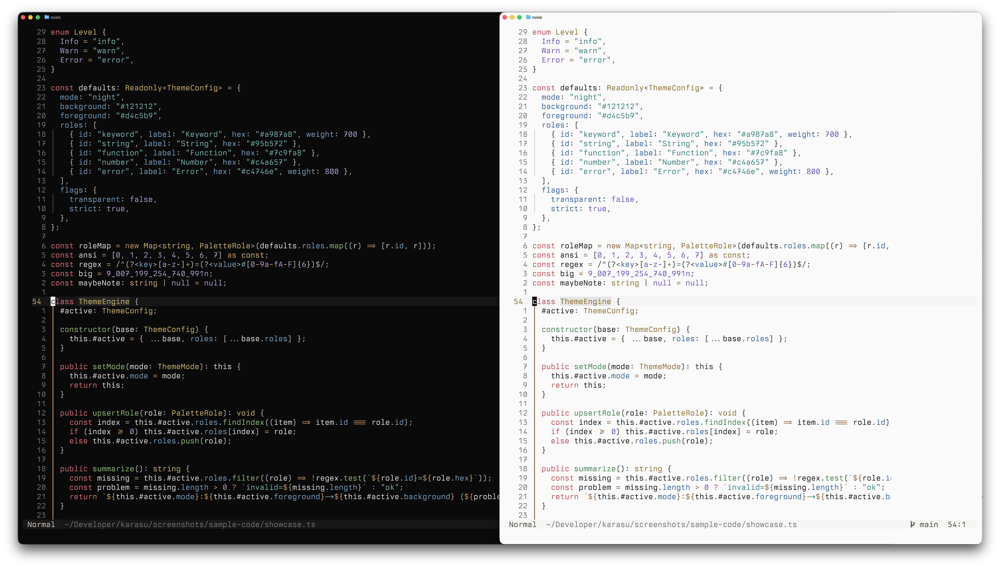
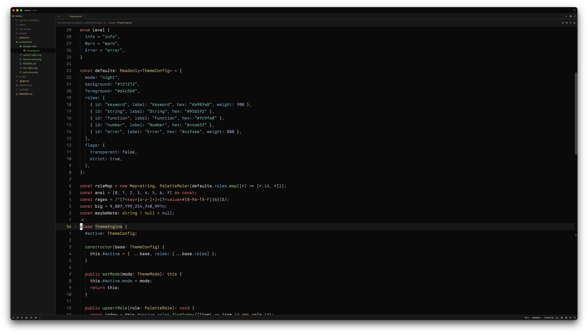

# カラス

Karasu is an atmospheric, terminal-first colorscheme with two variants: Night and Snow.





## Repo Layout

```
palette/     # Source of truth
platforms/   # Platform packages
scripts/     # Build + consistency checks
lua/         # Neovim plugin
colors/      # Neovim entrypoints
```

## Install

Manual per-app install is the default and safest path. The sections below only add theme files unless you choose otherwise.

### Neovim

```lua
{
  'scozu/karasu',
  lazy = false,
  priority = 1000,
  config = function()
    require('karasu').setup({ mode = "night" }) -- "night", "snow", "auto"
  end
}
```

Colorscheme commands:
```
:colorscheme karasu-night
:colorscheme karasu-snow
```

### Ghostty

```bash
mkdir -p ~/.config/ghostty/themes
cp "/path/to/karasu/platforms/ghostty/Karasu Night" ~/.config/ghostty/themes/
cp "/path/to/karasu/platforms/ghostty/Karasu Snow" ~/.config/ghostty/themes/
```

Config example:
```
theme = dark:Karasu Night,light:Karasu Snow
```

### Zed

```bash
mkdir -p ~/.config/zed/extensions/karasu
cp -r /path/to/karasu/platforms/zed/* ~/.config/zed/extensions/karasu/
```
Select **Karasu Night** or **Karasu Snow** in Zed.

### Obsidian (Minimal overlay)

Karasu for Obsidian is delivered as a CSS snippet on top of Minimal.

```bash
mkdir -p "<vault>/.obsidian/snippets"
cp /path/to/karasu/platforms/obsidian/snippets/karasu-minimal.css "<vault>/.obsidian/snippets/"
```

In Obsidian:
1. Enable Minimal theme.
2. Enable `karasu-minimal.css` in `Settings -> Appearance -> CSS snippets`.
3. In Minimal Theme Settings, set light/dark color schemes to `Default`.

### OpenCode

```bash
mkdir -p ~/.config/opencode/themes
cp /path/to/karasu/platforms/opencode/themes/karasu.json ~/.config/opencode/themes/
```

`~/.config/opencode/tui.json`:
```json
{
  "$schema": "https://opencode.ai/tui.json",
  "theme": "karasu"
}
```

`karasu` follows OpenCode's built-in theme pattern: Karasu Night in dark mode and Karasu Snow in light mode.

Karasu OpenCode themes use explicit hex values for stable, deterministic rendering.
Matching your terminal ANSI palette to Karasu (Ghostty/iTerm2) is optional, but improves cross-tool consistency.
OpenCode loads custom themes from `~/.config/opencode/themes`, `<project>/.opencode/themes`, and `./.opencode/themes`, with later locations taking priority.
For full color fidelity, make sure your terminal is running in truecolor mode.

`"theme"` as a plain string in `tui.json` is the current OpenCode standard.

### VS Code / Cursor

Use the VS Code extension in `platforms/vscode/`.
Cursor note: the same VS Code extension works in Cursor (no separate Cursor package needed).

```bash
bun run ./scripts/build-themes.mjs
```

Package with `vsce package` if you want a VSIX.
Marketplace links will be added here after the first public release.

### Optional: Install all app theme assets

This helper script copies Karasu theme files for Ghostty, OpenCode, and Zed in one run:

```bash
./scripts/install-all.sh
```

By default it does not edit app config files and does not run Neovim sync.

Examples:

```bash
# Configure OpenCode theme safely (with backup)
./scripts/install-all.sh --configure-opencode

# Sync Neovim plugin and auto-stash dirty local edits first
./scripts/install-all.sh --sync-neovim --neovim-auto-stash
```

## Development

Regenerate themes:
```bash
bun run ./scripts/build-themes.mjs
```

Check cross-platform color consistency:
```bash
bun run ./scripts/check-consistency.mjs
```

Neovim smoke checks:
```bash
bun run ./scripts/check-neovim-smoke.mjs
```

OpenCode compatibility checks:
```bash
bun run ./scripts/check-opencode-config-compat.mjs
```

## Release Checklist

1. `bun run ./scripts/build-themes.mjs`
2. `bun run ./scripts/check-consistency.mjs`
3. `bun run ./scripts/check-vscode-theme.mjs`
4. `bun run ./scripts/check-neovim-smoke.mjs`
5. `bun run ./scripts/check-opencode-config-compat.mjs`
6. Validate a fresh asset install with `./scripts/install-all.sh`

## Migration Notes

- If OpenCode is not picking up Karasu, set `"theme": "karasu"` in `~/.config/opencode/tui.json` and rerun `./scripts/install-all.sh --configure-opencode`.
- If OpenCode still shows the wrong custom theme, check for higher-precedence overrides in `tui.json`, `<project>/.opencode/themes/`, or `./.opencode/themes/`.
- If Neovim shows highlight-group spam on startup after updating Karasu, run:
  - `nvim --headless '+Lazy! sync karasu' +qa`
  - or run `./scripts/install-all.sh --sync-neovim --neovim-auto-stash`.

## Platform Docs

- [Neovim](platforms/neovim/README.md)
- [Ghostty](platforms/ghostty/README.md)
- [Zed](platforms/zed/README.md)
- [Obsidian (Minimal overlay)](platforms/obsidian/README.md)
- [OpenCode](platforms/opencode/themes/README.md)
- [VS Code / Cursor](platforms/vscode/README.md)
- [iTerm2](platforms/iterm2/README.md)

## References

Karasu draws inspiration from all of these excellent themes:
- [Gruvbox Material Dark](https://github.com/sainnhe/gruvbox-material)
- [Kanagawa Dragon](https://github.com/rebelot/kanagawa.nvim)
- [Kanso](https://github.com/webhooked/kanso.nvim)
- [Black Metal (Gorgoroth)](https://github.com/metalelf0/black-metal-theme-neovim)
