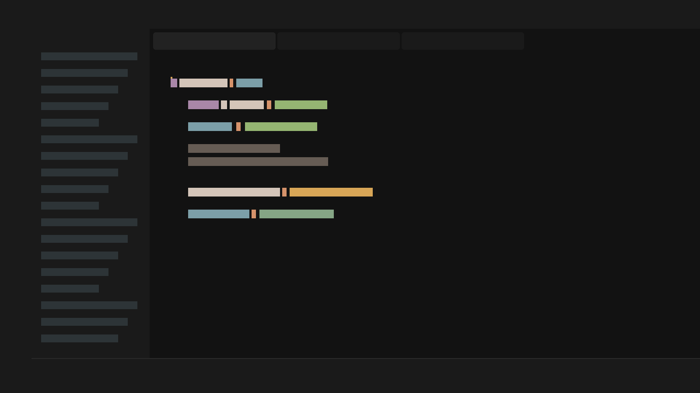
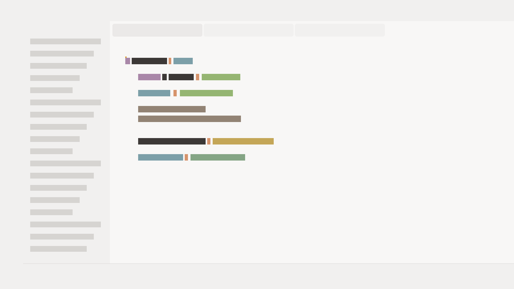

# Karasu Theme for VS Code

Karasu is a terminal-first color theme with two variants:

- **Karasu Night** (dark)
- **Karasu Snow** (light)

This extension is built from Karasu's shared palette source-of-truth so VS Code stays aligned with Neovim, Ghostty, Zed, and other platform outputs.

## Features

- Two curated variants with consistent semantic mapping.
- Expanded workbench coverage for common UI surfaces.
- Semantic highlighting enabled by default.
- Rich TextMate token coverage for common languages.
- ANSI terminal colors mapped to the Karasu palette.

## Theme Preview

### Karasu Night



### Karasu Snow



## Installation

### VS Code Marketplace

The marketplace listing will be linked here after first public release.

### Manual VSIX Install

From this repository root:

```bash
bun run ./scripts/build-themes.mjs
cd platforms/vscode
bun install
bun run package
```

Then install the generated `.vsix` file in VS Code or Cursor.

## Usage

1. Open command palette.
2. Run `Preferences: Color Theme`.
3. Choose either:
   - `Karasu Night`
   - `Karasu Snow`

## Compatibility

- VS Code `^1.85.0`
- Cursor (VS Code-compatible themes)

## Development

Generate themes from the monorepo source palette:

```bash
bun run ./scripts/build-themes.mjs
```

Run validation checks:

```bash
bun run ./scripts/check-consistency.mjs
bun run ./scripts/check-vscode-theme.mjs
```

Package from the extension directory:

```bash
cd platforms/vscode
bun install
bun run package
```

## Publishing

### Visual Studio Marketplace

Use `vsce publish` from `platforms/vscode` with Microsoft Entra-based authentication configured for your publisher.

### Open VSX

Use `ovsx publish` from `platforms/vscode` with an Open VSX token.

## License

MIT
